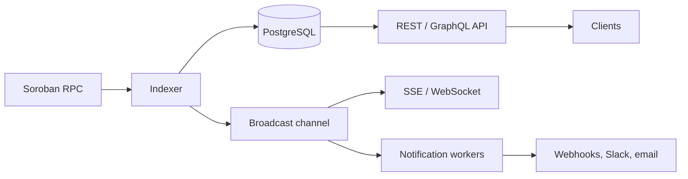

# System Design

See also `architecture.md`, `capacity-planning.md`, `disaster-recovery.md`, and `zero-trust.md`.

## High-level architecture

Components: an indexer that polls Soroban RPC and persists events, a PostgreSQL store (with optional read replica), an axum HTTP API, a streaming layer, and notification workers.

## Component interaction

1. The indexer fetches ledgers from RPC in batches and writes events with de-duplication on event id.
2. After commit it publishes each new event on an in-process broadcast channel.
3. SSE/WebSocket handlers and notification workers subscribe to that channel.
4. The API serves history from PostgreSQL (read pool) with cursor pagination.

## Data flow

RPC -> decode/normalize -> dedup -> insert (events table) -> broadcast -> subscribers. Reads: request -> auth/rate limit middleware -> handler -> read pool -> serialized response (optionally cached).

## Scalability decisions

- Stateless API replicas behind a load balancer; indexing is coordinated with advisory locks so only one replica indexes at a time.
- Read traffic goes to replicas via the read pool.
- Table partitioning and retention tiers bound table growth.
- Cursor pagination avoids deep OFFSET scans.

## Capacity planning

Size by three inputs: events per ledger (write rate), API requests per second, and concurrent streaming clients. Rules of thumb: one indexer writer per deployment, connection pool per replica sized below `max_connections / replicas`, and storage = average event size x events per day x retention days x index overhead (about 1.5x). See `capacity-planning.md` for details.

## Failure mode analysis

| Failure | Effect | Mitigation |
|---------|--------|------------|
| RPC unavailable | Indexing stalls | Retry with backoff, lag alert, `/healthz/rpc` |
| PostgreSQL primary down | Writes and reads fail | Readiness probe fails, failover, graceful degradation |
| Replica lag | Stale reads | Replica monitoring, fallback to primary |
| Slow webhook target | Delivery backlog | Circuit breaker, retry policy, queue limits |
| Indexer replica crash | Gap in ingestion | Lock released, another replica resumes from last ledger |
| Traffic spike | Latency rises | Rate limiting, load shedding, horizontal scaling |

## Security architecture

- API key authentication and per-key rate limiting; optional IP allow-lists.
- Webhook payloads signed (HMAC); secrets kept in a secret manager, rotated per `key-rotation.md`.
- TLS at the edge, encryption at rest for the database, security headers on responses.
- Least-privilege database roles, audit logging of administrative actions, dependency scanning in CI.
